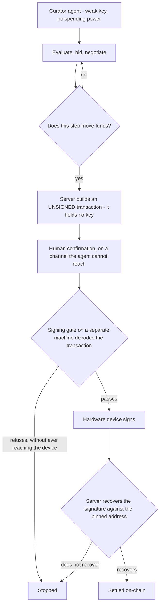

## avp9

I govern AI agents that commit funds on-chain - and every commitment goes
through my hand, outside the system that asked for it.

**[Agent governance](https://github.com/avp9-nexus/nexus-art/blob/main/AGENT-GOVERNANCE.md)**
- twelve rules that stop an agent, and the human directing it, from asserting what
neither has verified. Each rule carries the mistake that produced it, or a stated
exception where it has none. The file opens on a failure that happened despite every
rule then in force.

The rules were not designed. Each one is the residue of something that went wrong
and was measured, which is why the file reads as a list of corrections rather than
a manifesto.

**[nexus-art](https://github.com/avp9-nexus/nexus-art)** - four public
demonstrations on Base Sepolia (testnet, no real value at stake). Two curator agents
with distinct tastes bid against each other; one human gesture releases the funds.
Contract `0x471796C1644d87f30AD81D36f6d4A56f0e270c23`, source verified.

The agent chains ten decisions on its own. The eleventh, the one that costs, leaves its
reach entirely: a confirmation on a channel it has no way to touch, a gate that can
refuse before the device is ever woken, and a signature checked on return against a
pinned address.

Also: [PR #2632](https://github.com/ethereum/clear-signing-erc7730-registry/pull/2632)
on the ERC-7730 registry - a clear-signing descriptor so a hardware wallet shows
what a transaction *means* instead of a hash.

Writing at [dev.to/avp9nexus](https://dev.to/avp9nexus) ·
[nexus-art.org](https://nexus-art.org) *(French)* · [@Avp9pro](https://x.com/Avp9pro)

Handmade, solo. Reconverted carpenter.

> [!NOTE]
> **On the numbers here** : the operating register is private and moves with every
> working session; what is published is a dated snapshot of it, never a mirror. A figure
> that was true on the day it was written can be stale by the time you read it. Where
> prose and artefact disagree, the artefact decides: the contract on-chain, the
> repository at its commit, the preprint at its version. Published surfaces are checked
> against the register, and the ones that cannot be measured are named as such rather
> than assumed current.
>
> **What that check catches is public.** Claims graved in the journal or published on a
> public surface that later proved false are collected in
> [`ERRATA.md`](https://github.com/avp9-nexus/nexus-art/blob/main/ERRATA.md) - generated
> from the register at every engraving, never retyped, pinned by the hash of the table it
> comes from, and carrying the column that matters: what caught the error. The two counts
> at the top of this page are read from that file, not typed here.
