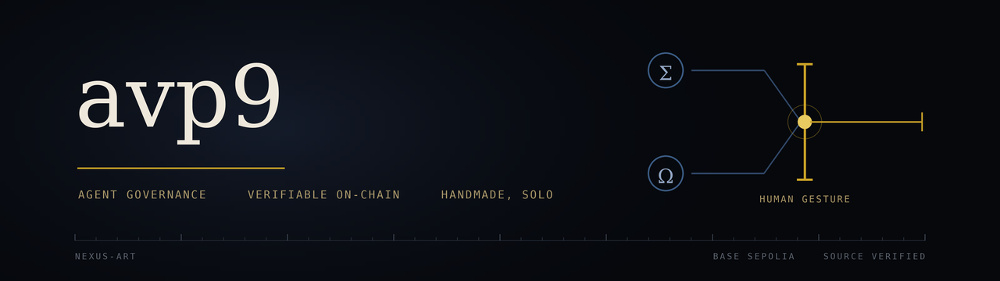

## avp9

I direct AI agents that buy art at auction — and every commitment of funds goes
through my hand, outside the system that asked for it.

**[nexus-art](https://github.com/avp9-nexus/nexus-art)** — three public
demonstrations on Base Sepolia. Two curator agents with distinct tastes bid
against each other; one human gesture releases the funds. Contract
`0x471796C1644d87f30AD81D36f6d4A56f0e270c23`, source verified.

**[Agent governance](https://github.com/avp9-nexus/nexus-art/blob/main/AGENT-GOVERNANCE.md)**
— twelve rules that stop an agent, and the human directing it, from asserting what
neither has verified. Each rule is paired with the mistake that produced it. The file
opens on a failure that happened despite every rule then in force.

Also: [PR #2632](https://github.com/ethereum/clear-signing-erc7730-registry/pull/2632)
on the ERC-7730 registry — a clear-signing descriptor so a hardware wallet shows
what a transaction *means* instead of a hash.

Writing at [dev.to/avp9nexus](https://dev.to/avp9nexus) ·
[nexus-art.org](https://nexus-art.org) *(French)* · [@Avp9pro](https://x.com/Avp9pro)

Handmade, solo. Reconverted carpenter.

**On the numbers here** — the operating register is private and moves with every
working session; what is published is a dated snapshot of it, never a mirror. A figure
that was true on the day it was written can be stale by the time you read it. Where
prose and artefact disagree, the artefact decides: the contract on-chain, the
repository at its commit, the preprint at its version. Published surfaces are checked
against the register, and the ones that cannot be measured are named as such rather
than assumed current.
